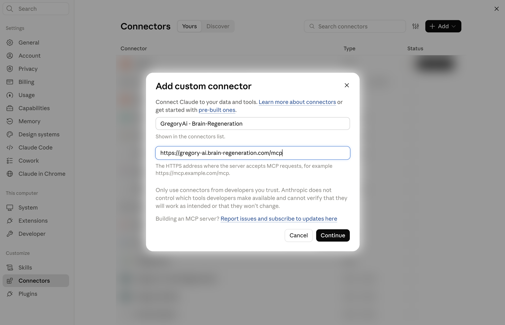
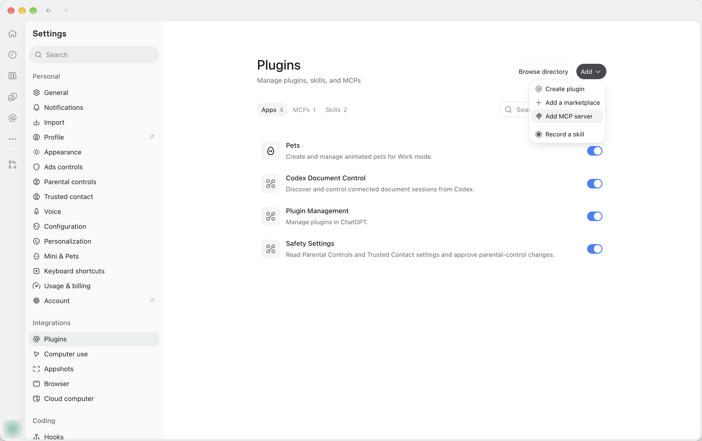
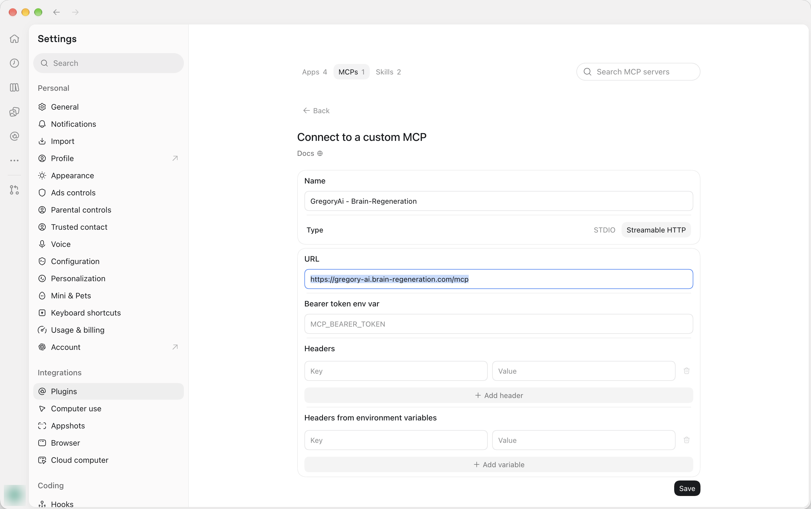

[GregoryAi](https://gregory-ai.com/) is the digital assistant that powers our website, and now you can use it directly and for free.

If you use Claude, ChatGPT, or another assistant that supports the Model Context Protocol (MCP), you can connect it to our website and ask it questions like these:

- "What has been published on remyelination in the last month, and which of those papers are open access?"
- "Are there any recruiting trials for progressive MS in Portugal or Spain?"
- "Which trials for Alzheimer's disease were registered since my last check?"

The assistant then searches through the collection you see on this site: research papers from all the major journals, clinical trials from the world's registries. 

## Connecting your AI assistant

Every assistant uses the same address:

```text
https://gregory-ai.brain-regeneration.com/mcp
```

Copy it exactly, with no slash at the end.

### Claude on the web and Claude Desktop




1. Open **Settings**, then **Connectors**.
2. Choose **Add custom connector**.
3. Give it a name like "GregoryAi - Brain Regeneration", and paste the address above.
4. Save. You don't need to sign in.

Custom connectors are available on Claude plans that support them. Once the connector is added, you can switch it on in any conversation from the tools menu.

### ChatGPT

These steps are for the ChatGPT desktop app, where MCP servers are added as plugins.

1. Open **Plugins**. You'll find it under **Customize** in the sidebar, or under **Integrations** in **Settings**.


2. Choose **Add**, then **Add MCP server**.

3. Give it a name like "GregoryAi - Brain Regeneration".
4. Set the type to **Streamable HTTP** and paste the address above into **URL**.
5. Leave the bearer token and header fields empty, then choose **Save**. You don't need to sign in.



### Other AI services

Any assistant that supports remote MCP servers over HTTP can connect to the same address. Look for "remote MCP server" or "custom connector" in its settings.

## What is MCP?

The Model Context Protocol is an open standard that lets an AI assistant use outside tools and data. Without it, an assistant answers from what it learned in training, which can be out of date. With our MCP server connected, it can look things up in our database for you.

Our server gives the assistant ten read-only tools:

| Tool              | What it does                                                 |
| :---------------- | :----------------------------------------------------------- |
| `list_subjects`   | Lists the research areas we cover                            |
| `search_articles` | Searches research papers by keyword, subject, category, journal, date and relevance |
| `get_article`     | Fetches one paper in full: abstract, authors, relevance scores and linked trials |
| `search_trials`   | Searches clinical trials by keyword, recruitment status, phase, country, sponsor, registration date or registry ID |
| `get_trial`       | Fetches one trial in full, including eligibility criteria and results |
| `search_authors`  | Finds researchers by name, ORCID or country                  |
| `get_author`      | Fetches a researcher's profile and, if asked, their co-authors |
| `list_categories` | Lists our topic categories, such as remyelination or cell therapy |
| `list_sponsors`   | Lists trial sponsors                                         |
| `get_stats`       | Counts papers and trials by subject, phase, region and more  |

The assistant will pick the right tool for your question automatically.

The server also comes with three ready-made prompts. In Claude they appear in the prompts menu next to the connector:

- **Research topic:** a survey of recent papers and trials on a topic you name.
- **Recent trials for subject:** trials that are recruiting or were recently registered for one subject.
- **Author profile:** a researcher's profile, built from their papers and affiliation.

## Researching articles

Some tips on how to search:

- **Name the subject.** We cover multiple sclerosis, Alzheimer's disease, Parkinson's disease, neuroinflammation, neuroimmune interactions and cell reprogramming. Mentioning one lets the assistant filter by it, instead of matching keywords across everything.
- **Ask for relevant papers only.** Our curators and machine learning models flag the papers that matter most for each subject. Ask for "relevant papers" and the assistant will filter on that flag. We explain how the scores work on the [relevancy scores](/relevancy-scores/) page. At the moment, this is only available for multiple sclerosis.
- **Ask about recent work.** The assistant can search by publication date, or by the date we found a paper. 
- **Go deeper on one paper.** Once something catches your eye, ask the assistant to open it. It will fetch the full abstract, the authors, the relevance scores and any clinical trials linked to the paper.
- **Don't give up on an empty result.** When a search finds nothing, the server tells the assistant which filters were applied and which ones are most likely too strict, so it can try again more broadly.

A good first question:

> "Using Brain Regeneration, find relevant papers on remyelination from the last 30 days. Group them by approach, such as small molecules, cell therapy and rehabilitation, and include each paper's DOI link."

## Tracking new clinical trials

Our database includes the 3 top registries to help you find all possible clinical trials.

The filters the assistant can use:

- **Recruitment status:** recruiting, not yet recruiting, completed and so on.
- **Registration date:** for example, "registered since 1 September".
- **Phase and study type:** for example, phase 2 or 3, interventional or observational.
- **Location:** country or region.
- **Sponsor:** a company, university or hospital.
- **Eligibility:** age and sex.
- **Registry ID:** NCT, EU CT, EudraCT or CTIS numbers, in any common format.

Things you can ask:

1. "Which multiple sclerosis trials registered since 1 September are recruiting or about to start?”
2. “Are there any clinical trials recruiting for Alzheimer's?”
3. “Give me a list of completed clinical trials for Parkinson’s”

### Make it a habit

Some assistants let you schedule tasks; you can set a recurring prompt to alert you when clinical trials open for recruiting.

### Before you act on a result

We do our best to keep information up to date, but you should always check with the original registry page.

Participation in clinical trials is a decision that should be made after consulting with your medical team. **Nothing the assistant tells you is medical advice.**

## Good to know

- **Read-only and open.** The server can only read our public data. It can't change anything, and it doesn't ask who you are.
- **The same curated scope as the site.** You get the subjects and sources we track, not the whole of PubMed. If a paper is missing, it may be outside our scope rather than missing from the literature.
- **We learn from what people look for.** Alongside each search, the assistant sends a short description of what it is looking for, such as "recent remyelination trials". We record these descriptions to find gaps in our coverage. The tools ask assistants to leave out personal details, and we store the descriptions separately from connection logs, so they can't be matched to the address a request came from.
- **Fair use.** The server is rate limited so that it stays available to everyone. For bulk downloads, use the CSV export on the site instead. If you need a different format, please contact us.

## For curators

Curators can sign in to a different address with their observatory account and approve the connection. This alows editing the information in the database:

- **Mark papers as relevant or not relevant** for a subject. A curator reading through last month's papers can ask the assistant to flag the three that matter, and clear the one the models got wrong. A paper can also be set back to "not reviewed".
- **Write takeaways and plain-English summaries.** The assistant can read the abstract to write a plain-engish summary or list of takeaways. The curator can review and edit the draft before it’s saved.
- **Link trials to papers.** When a paper reports results from a registered trial that we didn't connect automatically, the curator can add the link, or remove one that is’nt right.

Changes go live on the site straight away.

You can triage the week's new papers in one conversation: ask what's new in your area, read the abstracts mark the ones you think are relevant. That information will be used to improve the recommended papers.

If you lead a lab or research group working on CNS regeneration and would like to curate a research area with us, [get in touch](/contact/).

As always, the code behind the observatory is [open source](https://github.com/Human-Singularity/brain-regeneration). If something doesn't work the way you expect, or you have an idea for a new tool, [let us know](/contact/).
